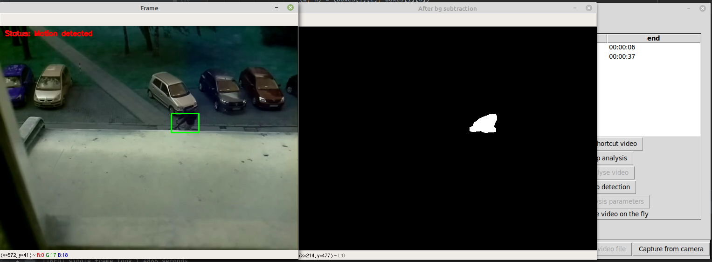
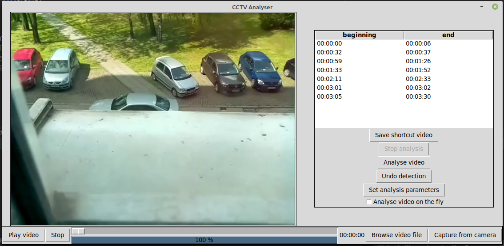
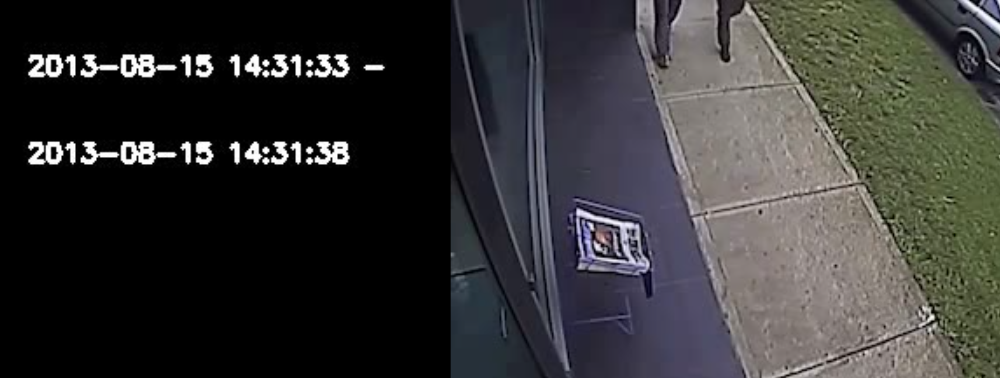
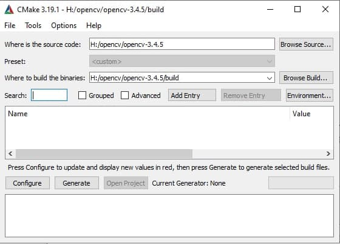
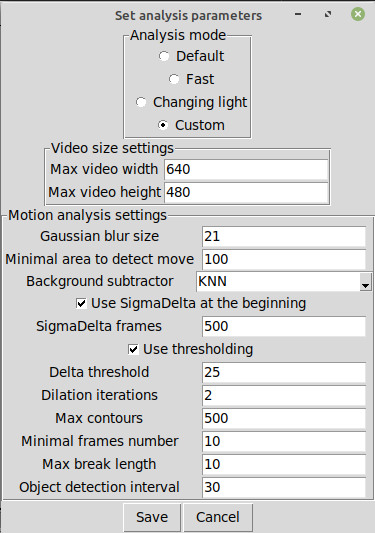
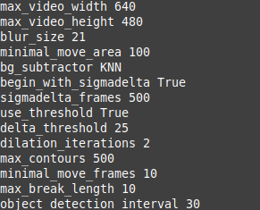

# cctv-analyser

Application developed to make shortcuts from CCTV recordings. Includes both desktop and console interface and options for customisation of analysis process.

After loading a video file user can customize analysis parameters and then perform analysis. It is possible to watch preview of detected changes. During analysis all detected essential fragments are marked in program's window and also an additional file with annotations containing time of fragment start and stop and detected objects is created. If video file contains metadata about when the recording has been taken, annotations file contains timestamps for fragments as real time. When analysis is completed it is possible to save a shortcut video file with only detected fragments included.

## Examples

Detection of a cyclist:



Main GUI window view after completed analysis:



Annotations for file without metadata:


Video shortcut (on the left hand side frame marking beginning of a detected fragment, on the right hand side sample frame from the fragment)



## Tech stack

* Python 3.8
* Tkinter for GUI
* [OpenCV 3.4.5](https://github.com/opencv/opencv/releases/tag/3.4.5) for image processing
* [PyBGS](https://github.com/andrewssobral/bgslibrary) library containing more background subtraction algorithms than OpenCV
* [YOLOv3](https://pjreddie.com/darknet/yolo/) neural network for object detection

## Running

### Linux (works on Ubuntu and Linux Mint)

1. Install necessary dependencies:
    ```
    sudo apt install gcc
    sudo apt install cmake
    sudo apt install libpq-dev
    sudo apt install python3-dev
    sudo apt install python3-tk
    sudo apt install python3-setuptools
    sudo apt install python3-pip
    sudo apt install python3-venv
    sudo apt install python3-wheel
    sudo apt install mediainfo
    ```
2. Download and unzip OpenCV source code from [official repository](https://github.com/opencv/opencv/releases/tag/3.4.5), it is crucial to not use too new version, 3.4.5 has been used during project development and is recommended (PyBGS library does not work with newer OpenCV releases)
3. Move to directory containing `opencv` directory, build and install OpenCV:
    ```
    mkdir build
    cd build
    cmake ../opencv
    make
    sudo make install
    ```
4. Clone this repository:
    ```
    git clone https://github.com/pwrobel5/cctv-analyser.git
    ```
5. Setup new virtual environment:
    ```
    python3 -m venv ./venv
    source venv/bin/activate
    ```
6. Install used Python libraries:
    ```
    pip3 install wheel
    pip3 install -r requirements.txt
    ```
7. Run project:
    ```
    python3 main.py
    ```

### Windows 10

1. Install Python3, CMake, VisualStudio compiler and pip
2. Clone this project
3. Create virtual environment from cmd or in IDE:
    ```
    python3 -m venv ./venv
    source venv/bin/activate
    ```
4. Install Python libraries (you may get errors from pybgs, but it is not a problem at this step)
    ```
    pip3 install wheel
    pip3 install -r requirements.txt
    ```
5. Download and unpack OpenCV from [official repository](https://github.com/opencv/opencv/releases/tag/3.4.5)
6. Create `build` directory in unpacked OpenCV directory
7. Generate project in CMake as shown in the picture below, click Configure and after that Generate

    
8. Compile OpenCV:
    ```
    cd build
    cmake.exe --build . --config Release --target INSTALL
    cmake.exe --build . --config Debug --target INSTALL
    ```
9. Modify environmental variables:
    ```
    setx PATH=%PATH%;OPENCVPATH\build\install\x64\vc15\bin
    setx OPENCV_DIR "OPENCVPATH\build\install\x64\vc15\lib"
    ```
10. Install PyBGS library:
    ```
    git clone --recursive https://github.com/andrewssobral/bgslibrary.git
    cd bgslibrary\build
    cmake -D OpenCV_DIR=%OpenCV_DIR% -D BGS_PYTHON_SUPPORT=ON-G "Visual Studio 15 2017 Win64" ..
    ```
11. Create directory `pybgs` in project's main directory and copy there file `pybgs.cp38-win_amd64.pyd` from `bgslibrary` directory.
12. Run project:
    ```
    python3 main.py
    ```

## Customizable parameters

It is possible to manually set analysis parameters as shown in the window below:



**Video size**:
* **Max video width** - maximal width of video frame below which frames for analysis won't be resized
* **Max video height** - analogous as above
In general, the smaller are frames for analysis, the faster is the whole process. However, one needs to remember that too small analysed frames would lead to omitting smaller objects.

**Motion analysis settings**:
* **Gaussian blur size** - during analysis all frames are blurred to cancel distortions, this number needs to be odd, the default value seems to be suitable for typical cases
* **Minimal area to detect move** - minimal area of detected change to treat it as important expressed in pixels number, if the program does not recognize small objects one would need to decrease this parameter, however it may lead to detection of unimportant elements such as tree moving because of wind
* **Background subtractor** - background subtractor algorithm used during analysis. In general KNN works correctly for recordings taken in rooms without significant changes in light intensity. ViBe and SigmaDelta are good for recordings from outdoors and are insensitive to light changes, however the first of them tends to omit small objects
* **Use SigmaDelta at the beginning** - one special case is when the video contains movement from the first frame. It has been revealed during tests that SigmaDelta is the algorithm which deals correctly with this situation. One could use it for arbitrarily given number of initial frames and after that application switches the algorithm to that chosen in previous section.
* **Use thresholding** - when this option is set, the frame with subtracted background is additionally processed with given threshold and dilation iterations to make detected contours smoother, default parameters are suitable for typical cases
* **Max contours** - maximal number of detected contours to treat detected change as important. This parameter is significant for KNN background subtractor, because in this case when there is a change in light intensity, the number of detected contours grows to enormous numbers. However it is usually better to use other subtractors when changing light is the case.
* **Minimal frames number** - minimal number of frames with detected changes to treat change as important, it allows the application to omit distortions which usually are not longer as few frames.
* **Max break length** - maximal number of frames without changes between fragments with detected changes to treat them as one change. If the analysis gives many short fragments with short breaks between them it would be better to increase this parameter.
* **Object detection interval** - interval in which frames from detected fragment with movement are sent to object detection, it is a slow process, so to make analysis faster one could increase this parameter.

## Console interface

To allow to perform analysis in simple way an additional console interface has been implemented. It could be launched as:
```
python3 console.py [-dev] [-param path] video_file
```
It is obligatory to specify the video file name (or device index when `-dev` flag is set). In addition it is possible to set analysis parameters by specifying path to parameters file with `-param` flag. An example of parameters file syntax is presented below. If the console interface has been launched with default parameters (without setting `-param` flag) it creates sample parameters file `config.txt`.


